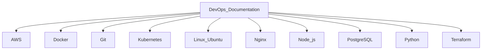

# DevOps Documentation & Notes

Welcome to my collection of notes and documentation related to my work and learning in the DevOps field. This repository contains resources, tutorials, and insights on various tools, technologies, and best practices I have encountered during my DevOps journey.

The topics covered include but are not limited to the following:

- **AWS**
- **Docker**
- **Git**
- **Kubernetes**
- **Linux (Ubuntu)**
- **Nginx**
- **Node.js**
- **PostgreSQL**
- **Python**
- **Terraform**
