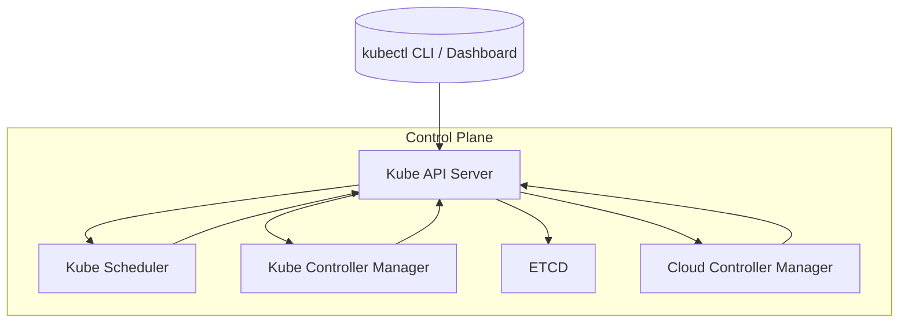
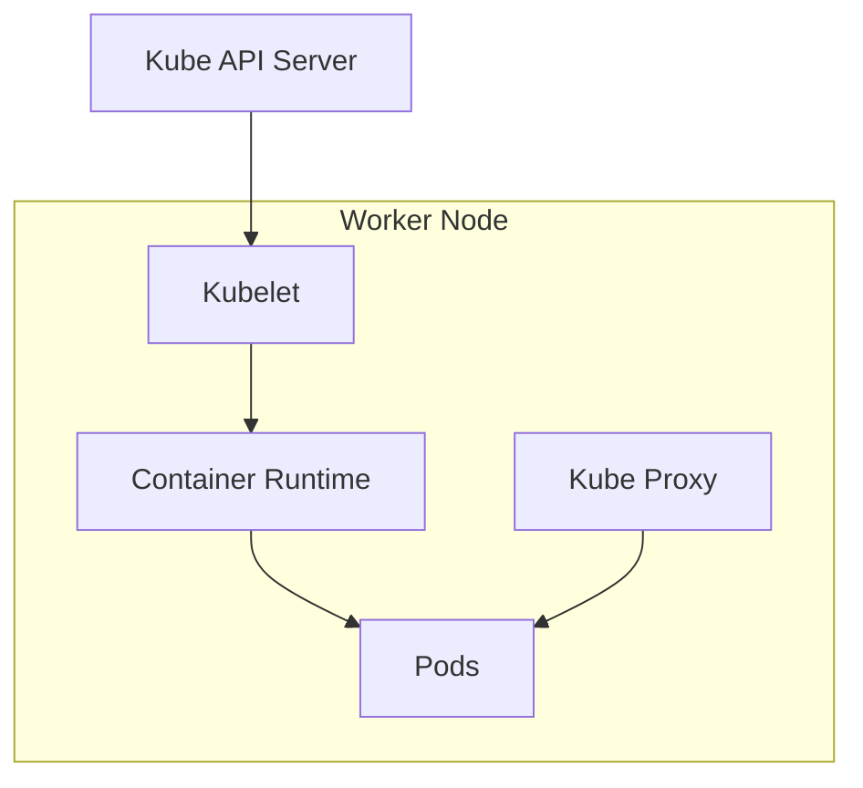
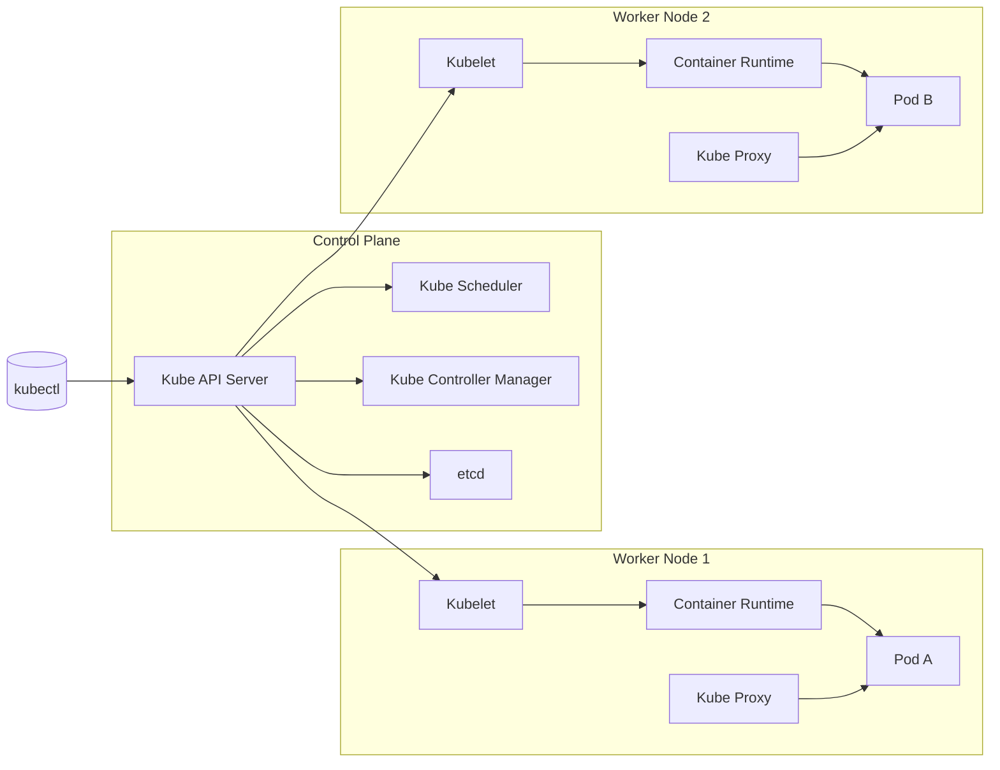

# Kubernetes Core Components

Kubernetes is a powerful container orchestration system that manages containerized applications across a cluster of machines. It has a **master-worker architecture**, where the **Control Plane (Master)** manages the cluster, and **Worker Nodes** run the applications.

---

## 🧠 Master Components (Control Plane)

The **Control Plane** is responsible for managing the cluster and orchestrating workloads.

### 📜 1. API Server (`kube-apiserver`)
- Acts as the front-end for the Kubernetes control plane.
- Receives REST commands and updates cluster state.

### 🧠 2. Scheduler (`kube-scheduler`)
- Assigns workloads (pods) to worker nodes based on resources and constraints.

### 👮 3. Controller Manager (`kube-controller-manager`)
- Runs controllers that watch the state of the cluster and make changes to reach the desired state.

### 📘 4. etcd
- A key-value store used as the backing store for all cluster data.

### 🔒 5. Cloud Controller Manager (optional)
- Integrates with cloud provider APIs (e.g., AWS, GCP) for things like Load Balancers and Node management.

#### Master Components Flowchart

---

## 🔧 Worker Node Components

Worker nodes are where the actual workloads (pods/containers) run.

### 🧱 1. Kubelet
- Ensures containers are running in a pod.
- Communicates with the API server and reports back status.

### 📦 2. Kube Proxy
- Maintains network rules for pod communication and service access.

### 🐳 3. Container Runtime
- Responsible for running containers (e.g., containerd, Docker, CRI-O).

#### Worker Components Flowchart

---

## 🕸️ Master-Worker Interaction Overview

This diagram shows how master and worker components interact in a full cluster:

---

## ✅ Summary Table

| Component              | Role                  | Master/Worker |
|------------------------|-----------------------|---------------|
| Kube API Server        | Entry point to cluster| Master        |
| etcd                   | Cluster data store    | Master        |
| Kube Scheduler         | Pod placement         | Master        |
| Controller Manager     | Maintains state       | Master        |
| Kubelet                | Node agent            | Worker        |
| Kube Proxy             | Networking rules      | Worker        |
| Container Runtime      | Runs containers       | Worker        |

